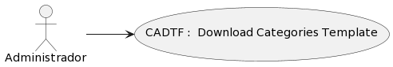

### Detalle de caso de uso
# CADTF : Download Categories Template
## DEFINICIÓN

- **Actores:** Administrador

- **Descripción:** El usuario Administrador es capaz de

- **Pre condiciones:** PR

- **Post condiciones:** PO

- **Fecha de creación:** 1 de Noviembre 2023

- **Fecha de actualización:** 1 de Noviembre 2023

## DIAGRAMA: Download Categories Template

## FLUJO BÁSICO: Download Categories Template
| # | ACTOR | # | SISTEMA | CÓDIGO |
|:---:|:---|:---:|:---|:---:|
-TS-VIE1-CADTF01-MPF23
-TS-EJE-CADTF02-Download Template(Categories)
-TS-RED-CADTF06-MPF35
-TS-MUE-CADTF07-MessageModal[dis_msg, type]
-TA-SEL-CADTF08-MessageModal : Yes
-TA-SEL-CADTF09-MessageModal : No
-TS-CLO-CADTF10-MessageModal
-TS-RED-CADTF11-MPF29
-TS-CLO-CADTF12-MessageModal
-TS-RED-CADTF13-CADTF02

## Diagrama de Flujo

    <object data="../../../diagrams/fl/fl_svg/FL_ADMIN_CADTF.svg" type="image/svg+xml" id="diagramaSvg" width="100%" height="100%"></object>

