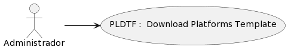

### Detalle de caso de uso:
# PLDTF : Download Platforms Template
## DEFINICIÓN

- **Actores:** Administrador

- **Descripción:** El usuario Administrador es capaz de

- **Pre condiciones:** PR

- **Post condiciones:** PO

- **Fecha de creación:** 1 de Noviembre 2023

- **Fecha de actualización:** 1 de Noviembre 2023

## DIAGRAMA: Download Platforms Template

## FLUJO BÁSICO: Download Platforms Template
| # | ACTOR | # | SISTEMA | CÓDIGO |
|:---:|:---|:---:|:---|:---:|
-TS-VIE1-PLDTF01-MPF23
-TS-EJE-PLDTF02-Download Template(Platforms)
-TS-RED-PLDTF06-MPF87
-TS-MUE-PLDTF07-MessageModal[dis_msg, type]
-TA-SEL-PLDTF08-MessageModal : Yes
-TA-SEL-PLDTF09-MessageModal : No
-TS-CLO-PLDTF10-MessageModal
-TS-RED-PLDTF11-MPF81
-TS-CLO-PLDTF12-MessageModal
-TS-RED-PLDTF13-PLDTF02
