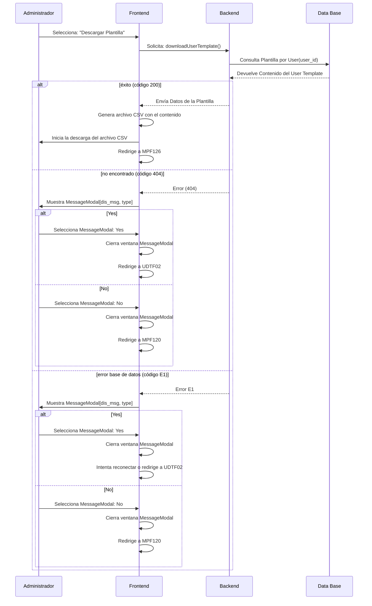
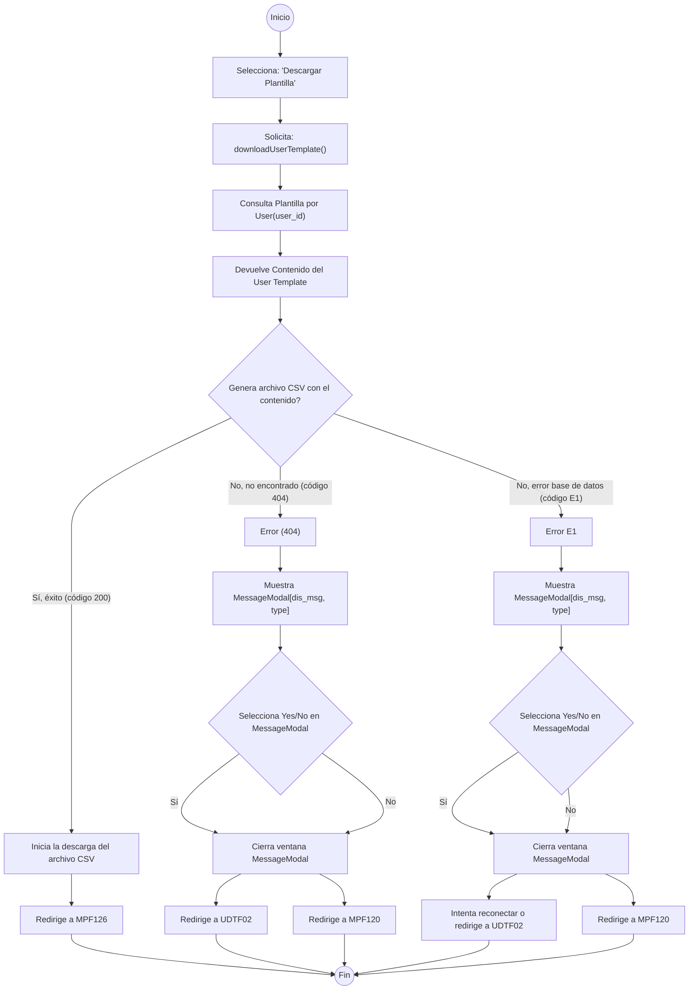

### Detalle de caso de uso
# USDTF : Download User Template
## DEFINICIÓN

- **Actores:** Administrador.

- **Descripción:** El usuario Administrador es capaz de descargar una plantilla en formato csv con el fin de tener la base para dar de alta masivamente a usuarios en el sistema.

- **Pre condiciones:** Haber ingresado con usuario y clave de Administrador.

- **Post condiciones:** Archivo "UserTemplate.csv" descargado correctamente.

- **Fecha de creación:** 1 de Noviembre 2023.

- **Fecha de actualización:** 3 de Noviembre 2023.

## DIAGRAMA: Download User Template

## FLUJO BÁSICO: Download User Template
| # | ACTOR | # | SISTEMA | CÓDIGO |
|:---:|:---|:---:|:---|:---:|
|   |   | 1 | «USDTF01» Viene de: MPF127 : SEL "Descargar Plantilla" |  |
|   |   | 2 | «USDTF02» Ejecuta: downloadUserTemplate() | 200 404 E1 |

### Códigos : downloadUserTemplate()
| Código | Tipo | Mensaje | Descripción |
|:---:|:---:|:---:|:---|
| 200 | success | Success | Descarga UserTemplate.csv |
| 404 | error | Record not found | Hay un problema con el servidor. |
| E1 | error | Database not available | No hay conexión con la base de datos. |

### FLUJO downloadUserTemplate() : 200
| # | ACTOR | # | SISTEMA | CÓDIGO |
|:---:|:---|:---:|:---|:---:|
|   |   | 1 | «USDTF06» Redirige a: MPF126 : Esperar acción de usuario |  |

### FLUJO downloadUserTemplate() : 404 E1
| # | ACTOR | # | SISTEMA | CÓDIGO |
|:---:|:---|:---:|:---|:---:|
|   |   | 1 | «USDTF07» Muestra: showMessageModal(dis_msg, type) |  |

### FLUJO downloadUserTemplate() : 404 E1 : Yes
| # | ACTOR | # | SISTEMA | CÓDIGO |
|:---:|:---|:---:|:---|:---:|
| 1 | «USDTF08» Selecciona: MessageModal : Yes  | 2 | «USDTF10» Cierra: MessageModal |  |
|   |   | 3 | «USDTF11» Redirige a: MPF120 : Muestra MainUsersListPage |  |

### FLUJO downloadUserTemplate() : 404 E1 : No
| # | ACTOR | # | SISTEMA | CÓDIGO |
|:---:|:---|:---:|:---|:---:|
| 1 | «USDTF09» Selecciona: MessageModal : No  | 2 | «USDTF12» Cierra: MessageModal |  |
|   |   | 3 | «USDTF13» Redirige a: USDTF02 |  |

## Diagrama de Flujo

    <object data="https://sdmunozo.github.io/dev4urest/developer_guide/diagrams/fl/fl_svg/FL_ADMIN_USDTF.svg" type="image/svg+xml" id="diagramaSvg" width="100%" height="100%"></object>

<a href="https://sdmunozo.github.io/dev4urest/developer_guide/diagrams/fl/fl_svg/FL_ADMIN_USDTF.svg" target="_blank">Abrir diagrama de flujo FL_ADMIN_USDTF en nueva pestaña</a>

## Diagrama de Secuencia

