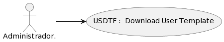

### Detalle de caso de uso
# USDTF : Download User Template
## DEFINICIÓN

- **Actores:** Administrador

- **Descripción:** El usuario Administrador es capaz de

- **Pre condiciones:** PR

- **Post condiciones:** PO

- **Fecha de creación:** 1 de Noviembre 2023

- **Fecha de actualización:** 1 de Noviembre 2023

## DIAGRAMA: Download User Template

## FLUJO BÁSICO: Download User Template
| # | ACTOR | # | SISTEMA | CÓDIGO |
|:---:|:---|:---:|:---|:---:|
-TS-VIE1-USDTF01-MPF23
-TS-EJE-USDTF02-Download Template(User)
-TS-RED-USDTF06-MPF126
-TS-MUE-USDTF07-MessageModal[dis_msg, type]
-TA-SEL-USDTF08-MessageModal : Yes
-TA-SEL-USDTF09-MessageModal : No
-TS-CLO-USDTF10-MessageModal
-TS-RED-USDTF11-MPF120
-TS-CLO-USDTF12-MessageModal
-TS-RED-USDTF13-USDTF02

## Diagrama de Flujo

    <object data="https://sdmunozo.github.io/dev4urest/developer_guide/diagrams/fl/fl_svg/FL_ADMIN_USDTF.svg" type="image/svg+xml" id="diagramaSvg" width="100%" height="100%"></object>

<a href="https://sdmunozo.github.io/dev4urest/developer_guide/diagrams/fl/fl_svg/FL_ADMIN_USDTF.svg" target="_blank">Abrir diagrama de flujo FL_ADMIN_USDTF en nueva pestaña</a>

