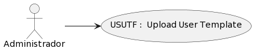

### Detalle de caso de uso
# USUTF : Upload User Template
## DEFINICIÓN

- **Actores:** Administrador

- **Descripción:** El usuario Administrador es capaz de

- **Pre condiciones:** PR

- **Post condiciones:** PO

- **Fecha de creación:** 1 de Noviembre 2023

- **Fecha de actualización:** 1 de Noviembre 2023

## DIAGRAMA: Upload User Template

## FLUJO BÁSICO: Upload User Template
| # | ACTOR | # | SISTEMA | CÓDIGO |
|:---:|:---|:---:|:---|:---:|
-TS-VIE1-USUTF01-MPF128
-TS-MUE-USUTF02-UploadFileModal('User')
-TA-SEL-USUTF03-Cargar Archivo ['users.csv']
-TS-EJE-USUTF04-Upload File('users.csv')
-TS-RED-USUTF09-MPF120
-TS-MUE-USUTF10-MessageModal[dis_msg, type]
-TA-SEL-USUTF11-MessageModal : Yes
-TA-SEL-USUTF12-MessageModal : No
-TS-CLO-USUTF13-MessageModal
-TS-RED-USUTF14-USUTF04
-TS-CLO-USUTF15-MessageModal
-TS-RED-USUTF16-MPF120

## Diagrama de Flujo

    <object data="https://sdmunozo.github.io/dev4urest/developer_guide/diagrams/fl/fl_svg/FL_ADMIN_USUTF.svg" type="image/svg+xml" id="diagramaSvg" width="100%" height="100%"></object>

