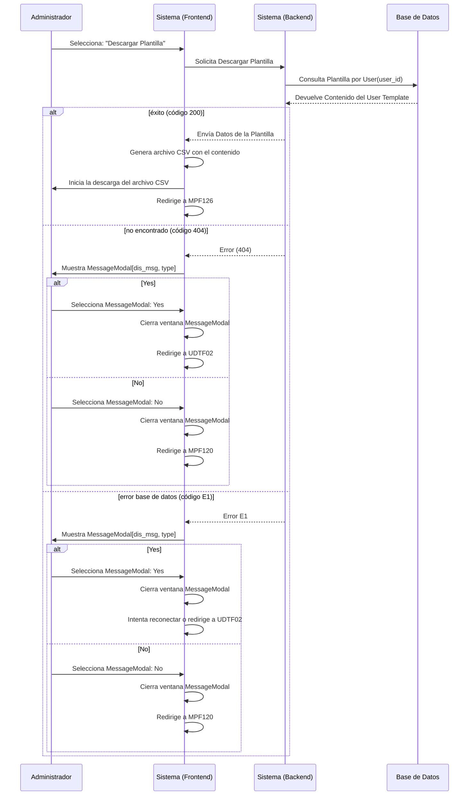

# Bienvenido a la Documentación de Mi Sistema

## Ejemplo de Markdown

Aquí puedes escribir texto en formato Markdown.

## Diagrama de Mermaid



```
digraph {
    A -> B;
    B -> C;
    A -> C;
    C -> D;
}
```

```plantuml
@startuml
Alice -> Bob: Hello
Bob -> Alice: Hi!
@enduml


## Visualización Interactiva del SVG

<div style="border: 1px solid black; width: 800px; height: 600px; overflow: hidden;">
    <object data="./diagrams/fl/fl_svg/FL-ADMIN-CADTF.svg" type="image/svg+xml" id="diagramaSvg" width="100%" height="100%"></object>
</div>

<script>
window.addEventListener("load", function() {
    var svgElement = document.querySelector('#diagramaSvg').contentDocument.documentElement;
    svgPanZoom(svgElement, {
        zoomEnabled: true,
        controlIconsEnabled: true
    });
});

document.addEventListener('DOMContentLoaded', function() {
    var plantUmlElements = document.querySelectorAll('code.language-plantuml');

    plantUmlElements.forEach(function(element) {
        var plantUMLText = element.innerText;
        var encodedPlantUML = plantumlEncoder.encode(plantUMLText);
        var img = document.createElement('img');
        img.src = 'http://www.plantuml.com/plantuml/png/' + encodedPlantUML;
        element.parentElement.replaceWith(img);
    });
});
</script>
